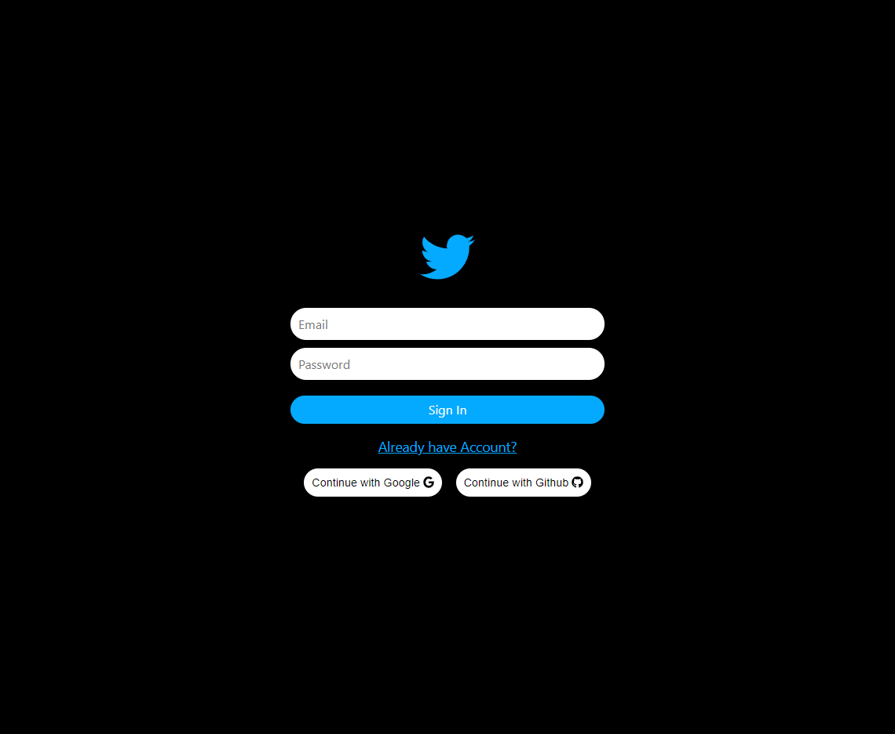
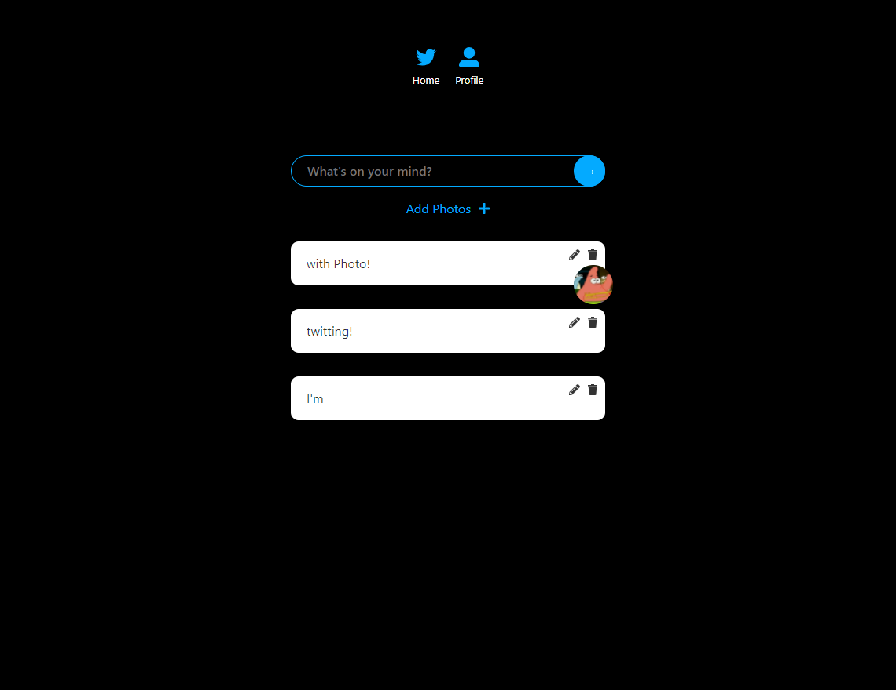
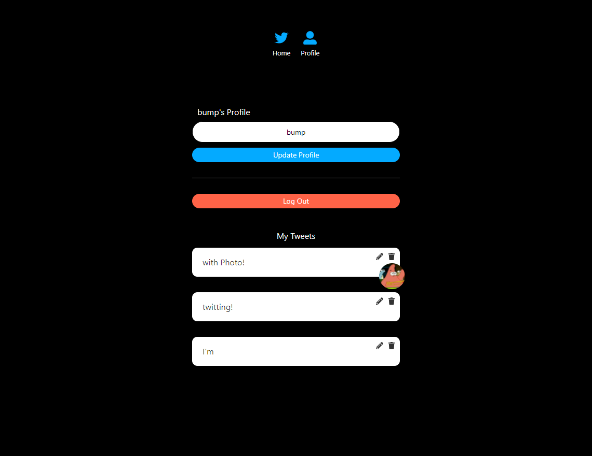
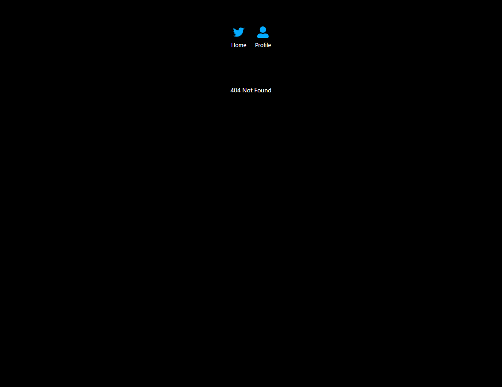

<h1 align="center">Welcome to twitter-clone-with-firebase 👋</h1>
<p>
  
  <a href="#" target="_blank">
    
  </a>
</p>

Clone Twitter with React & Firebase

### 🏠 [Homepage](https://caesiumy.github.io/twitter-clone-with-firebase)

## 📷Screenshots

<details>
  <summary>Auth Page</summary>
  
</details>

<details>
  <summary>Home Page</summary>
  
</details>

<details>
  <summary>Profile Page</summary>
  
</details>
<details>

  <summary>404 Page</summary>
  
</details>

## 🔰How to start

### Install

```sh
npm install
```

### Usage

```sh
npm run start
```

## Author

👤 **Caesiumy**

* Website: https://caesiumy.github.io/
* Github: [@Caesiumy](https://github.com/Caesiumy)

## Show your support

Give a ⭐️ if this project helped you!

***
_This README was generated with ❤️ by [readme-md-generator](https://github.com/kefranabg/readme-md-generator)_